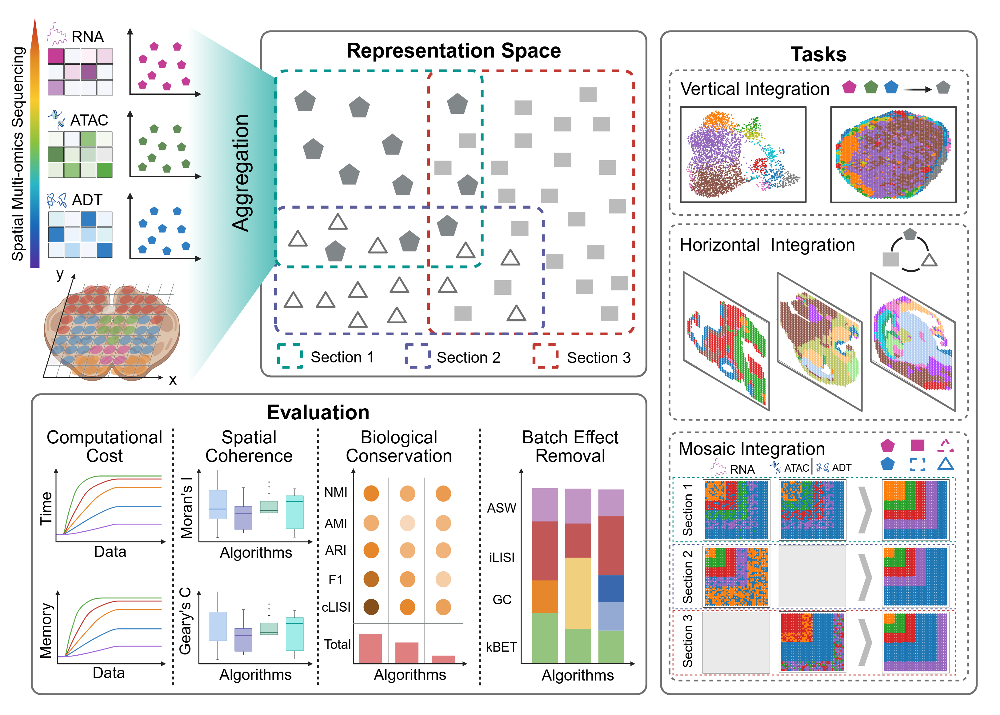

# SMOBench: A Comprehensive Benchmark for Spatial Multi-Omics Integration

<p align="center">
  
</p>

**SMOBench** is the first systematic benchmark for evaluating spatial multi-omics integration methods. It compares **16 computational methods** across **diverse biological datasets** spanning multiple tissue types and modality combinations (RNA+ADT, RNA+ATAC), using a comprehensive evaluation framework with **19+ metrics** covering spatial coherence, biological conservation, and batch effect removal.

## Highlights

- **16 integration methods**: SpatialGlue, SpaMosaic, PRAGA, COSMOS, PRESENT, CANDIES, MISO, SMOPCA, SpaBalance, SpaMI, SpaMV, SpaMultiVAE, SpaFusion, MultiGATE, SWITCH, and more
- **3 integration tasks**: Vertical (cross-modality), Horizontal (cross-batch), and Mosaic integration
- **Multiple tissues**: Human lymph nodes, tonsils; Mouse embryos, spleen, thymus, brain
- **2 modality types**: RNA+Protein (ADT) and RNA+Chromatin Accessibility (ATAC)
- **4 clustering algorithms**: Leiden, Louvain, K-means, mclust
- **Comprehensive evaluation**: Spatial Coherence (SC), Biological Conservation (BioC), Batch Effect Removal (BER), and Cross-Modal Global Topology Consistency (CM-GTC)

## Repository Structure

```
SMOBench/
├── benchmark/
│   ├── Methods/           # 16 integration method implementations
│   ├── _myx_Methods/      # Custom method modifications for benchmark
│   ├── Scripts/            # Standardized execution workflows
│   │   ├── vertical_integration/
│   │   ├── horizontal_integration/
│   │   ├── data_preparation/
│   │   ├── evaluation/
│   │   └── visualization/
│   ├── _myx_Scripts/       # Batch execution scripts
│   ├── Eval/               # Evaluation framework
│   ├── Utils/              # Shared utilities (universal clustering)
│   ├── Draw/               # Visualization scripts (Python + R)
│   ├── Dataset/            # Data structure (download separately)
│   ├── docs/               # Documentation
│   └── Framework/          # Framework diagrams
└── README.md
```

## Datasets

### With Ground Truth (Supervised Evaluation)

| Dataset | Modality | Tissue | Samples |
|---------|----------|--------|---------|
| 3M_Simulation | RNA+ADT/ATAC | Simulated | Multiple |
| Human_Lymph_Nodes | RNA+ADT | Human lymphoid | A1, D1 |
| Human_Tonsils | RNA+ADT | Human tonsil | S1, S2, S3 |
| Mouse_Embryos | RNA+ATAC | Mouse embryo | E11, E13, E15, E18 |

### Without Ground Truth (Unsupervised Evaluation)

| Dataset | Modality | Tissue | Samples |
|---------|----------|--------|---------|
| Mouse_Spleen | RNA+ADT | Mouse spleen | Spleen1, Spleen2 |
| Mouse_Thymus | RNA+ADT | Mouse thymus | Thymus1-4 |
| Mouse_Brain | RNA+ATAC | Mouse brain | ATAC, H3K27ac, H3K27me3, H3K4me3 |

### Data Access

Download datasets from Google Cloud Storage:

```bash
gsutil -m cp -r gs://gtex_histology/SMOBench/Dataset/withGT/ benchmark/Dataset/withGT/
gsutil -m cp -r gs://gtex_histology/SMOBench/Dataset/woGT/ benchmark/Dataset/woGT/
```

Or from [Google Drive](https://drive.google.com/drive/u/1/folders/11zYh27BK9QuqU7zObApCYSzSEMqHS0G6).

## Evaluation Framework

### Metric Categories

| Category | Metrics | Tasks |
|----------|---------|-------|
| **Spatial Coherence (SC)** | Moran's I, Geary's C | All |
| **Biological Conservation (BioC)** | ARI, NMI, AMI, FMI, Purity, Homogeneity, Completeness, V-measure, F-measure, Jaccard, Dice, Silhouette, Calinski-Harabasz, Davies-Bouldin, ASW, cLISI | All |
| **Batch Effect Removal (BER)** | ASW (batch), iLISI, kBET, Graph Connectivity | Horizontal, Mosaic |
| **CM-GTC** | Cross-Modal Global Topology Consistency | All |

### Integration Tasks

- **Vertical Integration**: Cross-modality within same sample (BioC + SC)
- **Horizontal Integration**: Cross-batch same modality (BioC + SC + BER)
- **Mosaic Integration**: Mixed modality and batch (BioC + SC + BER)

## Quick Start

### 1. Setup Environment

```bash
conda create -n smobench python=3.9
conda activate smobench
# See benchmark/docs/setup.md for detailed installation
```

### 2. Run Integration

```bash
# Example: Run SpatialGlue on Human Tonsils
python benchmark/Scripts/vertical_integration/run_SpatialGlue.py \
    --rna_path benchmark/Dataset/withGT/Human_Tonsils/S1_rna.h5ad \
    --adt_path benchmark/Dataset/withGT/Human_Tonsils/S1_adt.h5ad \
    --save_path benchmark/Results/
```

### 3. Evaluate

```bash
python benchmark/Eval/eval_vertical_integration.py
```

### 4. Visualize

```bash
# Generate benchmark figures
python benchmark/Draw/draw_heatmap.py
```

## Documentation

- [Setup Guide](benchmark/docs/setup.md) - Environment configuration and installation
- [Workflow Guide](benchmark/docs/workflow.md) - Complete execution pipeline
- [Evaluation Guide](benchmark/docs/evaluation.md) - Metrics and evaluation details

## Citation

If you use SMOBench in your research, please cite:

```bibtex
@article{smobench2025,
  title={SMOBench: A Comprehensive Benchmark for Spatial Multi-Omics Integration},
  journal={Nature Methods},
  year={2025}
}
```

## License

This project is licensed under the MIT License - see the [LICENSE](LICENSE) file for details.
