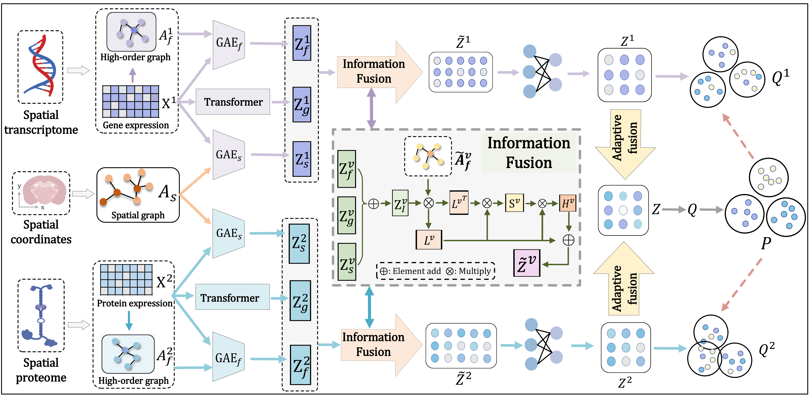

# SpaFusion: A multi-level fusion model for clustering spatial multi-omics data
The source code and input data of SpaFusion.



## Requirement
SpaFusion is implemented in the pytorch framework, please run SpaFusion on CUDA. 
```
conda env create -f environment.yml
```

## Usage
## Clone this repo.
```
git clone https://github.com/polarisChen/SpaFusion.git
```

### Example command
Take the dataset "Human_lymph_node_D1" as an example
```
python main.py
```
